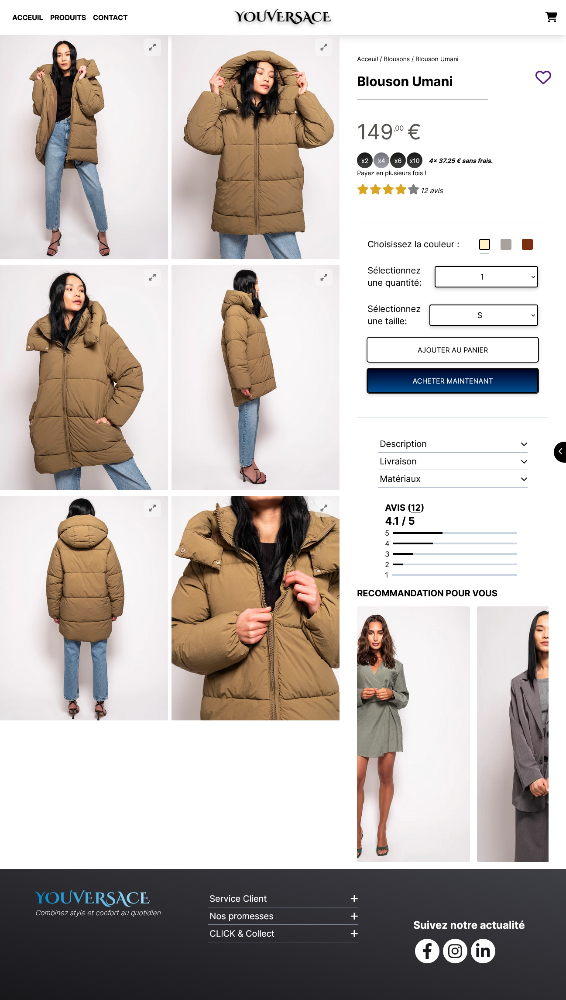

## Product page Challenge


### Preview



### Major Features
Responsieness / Multi layouts / Multi navigation menus
Picture container can be scroll to right on mobile 
Dynamic ratings
Dynamic split price
Interactive animations

### Front-End Challenge
This project is my participation of Front-End challenge organised by Le designer du web
https://www.youtube.com/@LeDesignerduWeb

### How to install the project
````
git clone https://github.com/ixouu/product-page-challenge.git
cd product-page-challenge
npm install
npm start

````
You'll be able to visit the project at http://localhost:3000/

### Visit me
https://productpage-challenge.vercel.app/

### Do you want the see more?
You are welcome to visit my portfolio at http://julien-chanon.fr/ where you will find more of my projects and who am I.